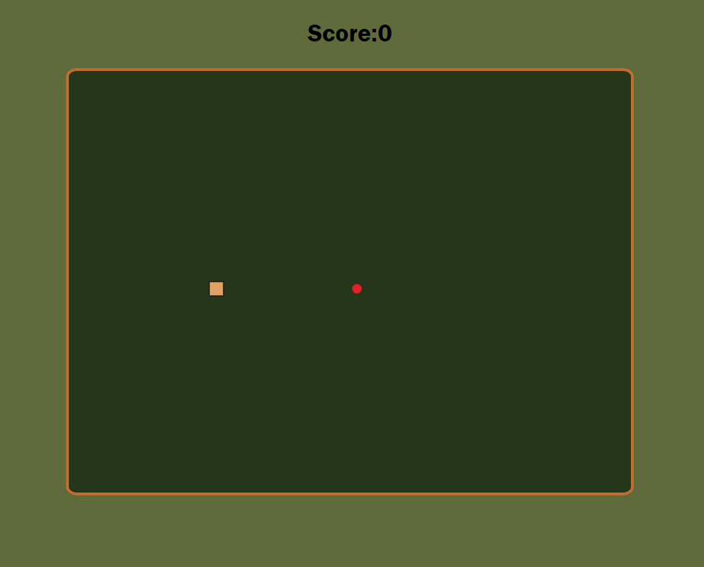

## Snake Game App

Kill some time or sharpen your reaction time with this Snake Game.

 

Link to working demo: [Snake Game](https://rfussell17.github.io/Snake-Game/)

  

## Summary

This is my version of the classic Snake Game App. It's built with HTML, CSS and vanilla JS. No Libraries or Frameworks were used. You can control the snake with the D-pad. When the snake eats the apple, the snake will grow and another apple will be randomly generated on the board. The game also keeps track of how many apples were eaten. 

**Author**
 
**Robin Fussell** _- Software Developer_ | [LinkedIn](https://www.linkedin.com/in/robin-fussell17/)
